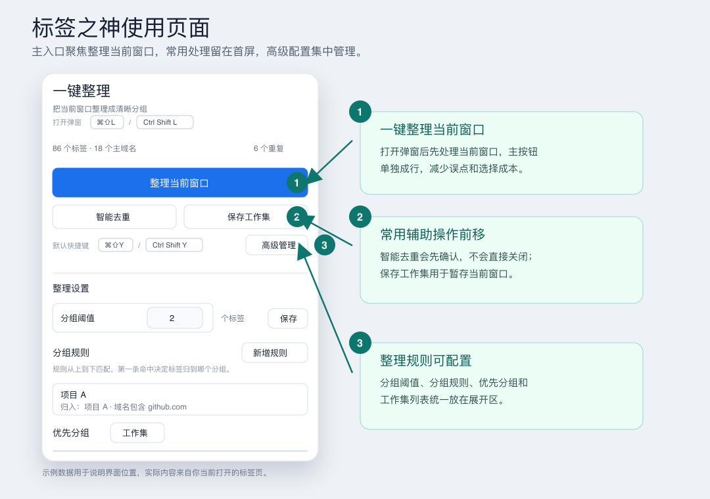

# 标签之神

<p align="center">
  
</p>

`标签之神` 是一个 Chrome 标签页管理插件，专门处理标签页过多时的两个麻烦：

- 快速找回页面，包括已经打开或刚关闭的页面。
- 一键把当前窗口里的标签页整理成清晰分组。

它不追求复杂的工作流管理，只把搜索、整理、去重和工作集保存这几件事做顺。

## 界面预览



## 主要能力

| 能力 | 说明 |
| --- | --- |
| 搜索切换 | 输入标题、网址、主域名或分组名，在所有已打开窗口中查找标签页。 |
| 找回关闭页面 | 输入关键词后，会同时搜索 Chrome 最近关闭的标签页。 |
| 一键整理 | 把当前窗口按主域名和自定义规则归拢，减少标签栏里的散乱顺序。 |
| 智能去重 | 找出重复标签页，关闭前需要确认，避免误删正在使用的页面。 |
| 保存工作集 | 保存当前窗口，后续可以恢复一组常用页面。 |
| 自定义分组 | 在“高级管理”里新增自定义分组规则，把同一项目的不同域名放进同一个分组。 |

## 快速安装

1. 下载或克隆本项目。
2. 打开 Chrome 的 `chrome://extensions`。
3. 开启右上角的“开发者模式”。
4. 点击“加载已解压的扩展程序”。
5. 选择本项目目录。
6. 把“标签之神”固定到浏览器工具栏。

本项目不需要构建步骤，源码目录可以直接作为 Chrome 插件加载。

## 常用快捷键

| 操作 | macOS | Windows 和 Linux |
| --- | --- | --- |
| 打开弹窗 | `Command+Shift+L` | `Ctrl+Shift+L` |
| 整理当前窗口 | `Command+Shift+Y` | `Ctrl+Shift+Y` |
| 保存当前窗口为工作集 | `Command+Shift+S` | `Ctrl+Shift+S` |

如果快捷键和其他扩展冲突，可以在 Chrome 的 `chrome://extensions/shortcuts` 里调整。

## 一键理顺满屏标签

打开弹窗后，搜索框会自动聚焦。直接输入关键词，就能按标题、网址、主域名或自定义分组名查找标签页。

搜索结果支持键盘操作：

- `↑` / `↓` 选择结果。
- `Enter` 跳转到选中的标签页。
- 如果结果在其他窗口，插件会先聚焦目标窗口，再激活目标标签页。

没有输入关键词时，弹窗只展示最近使用的已打开页面，避免历史结果干扰快速切换。输入关键词后，才会搜索最近关闭的标签页。

点击“整理当前窗口”后，插件会尽量保持你原本的工作顺序，同时把相同主域名和命中自定义规则的页面放到一起。固定标签会继续保留在前面。

## 整理规则

默认规则按主域名归拢标签页。例如 `mail.google.com` 和 `docs.google.com` 会归到 `google.com`。

分组规则是插件的核心能力，整理时会遵循这些规则：

- 达到分组阈值的主域名会创建 Chrome 原生标签分组。
- 真实分组会排在零散单标签页前面，避免整理后仍被单个标签打断。
- 优先分组会排在普通分组前面，适合把常用工作站点固定到更靠前的位置。
- 同一主域名内会按子域名稳定排序，让同站点的不同产品保持可预期顺序。
- 规则阈值可以单独设置；留空使用全局阈值，界面会直接显示最终生效的阈值。
- 即使没有达到建组阈值，同一项目下的标签页也会相邻排列；阈值只决定是否创建 Chrome 原生分组。

需要把多个域名放进同一个项目时，可以在“高级管理”里新增自定义分组规则。规则支持条件组，也支持“满足全部”和“满足任一”，用于表达简单的 AND / OR 组合。

## 高级管理

“高级管理”里集中放低频设置和确认操作：

- 调整全局分组阈值。
- 新增、编辑或停用自定义分组规则。
- 设置优先分组顺序。
- 查看、恢复或管理工作集。
- 确认并关闭重复标签页。

这些能力默认收起，是为了让弹窗首屏继续服务最高频的搜索和整理。

## 权限与隐私

`标签之神` 只使用标签页管理需要的权限：

| 权限 | 用途 |
| --- | --- |
| `tabs` | 读取、激活、移动、创建和关闭标签页。 |
| `tabGroups` | 创建和更新 Chrome 原生标签分组。 |
| `storage` | 在本地保存插件配置、规则和工作集。 |
| `sessions` | 读取和恢复 Chrome 最近关闭的标签页或窗口。 |

所有数据都保存在本地 `chrome.storage.local`。当前版本没有账号系统，也不会上传你的标签页数据。

## 开发与校验

运行本地校验：

```bash
node scripts/校验插件.js
```

也可以分别检查脚本语法：

```bash
node --check background.js
node --check popup.js
```

发布版本标签时使用：

```bash
scripts/发布标签.sh
```

## 许可证

本项目基于 MIT 许可证开源，详见 [LICENSE](LICENSE)。
